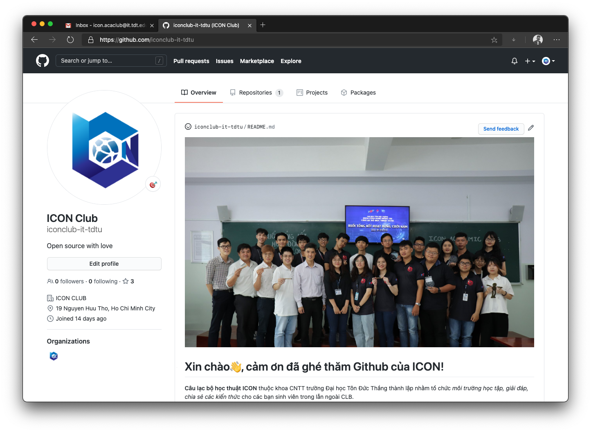
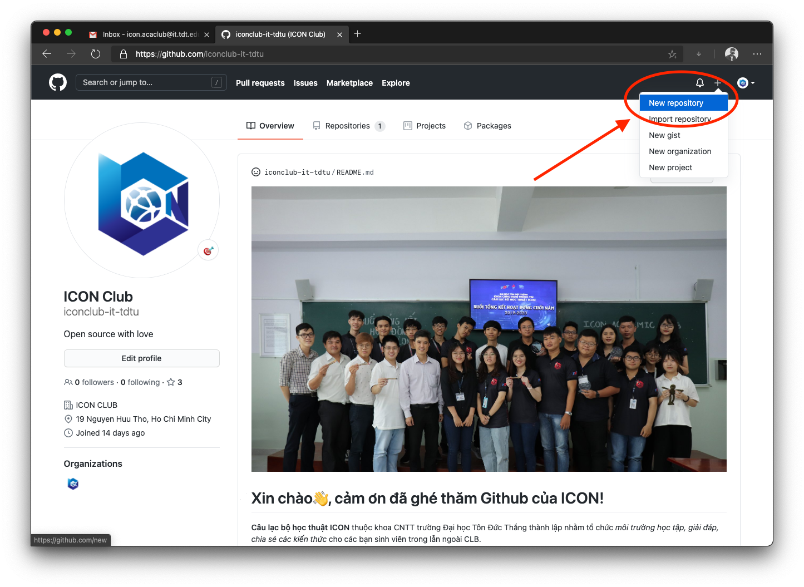
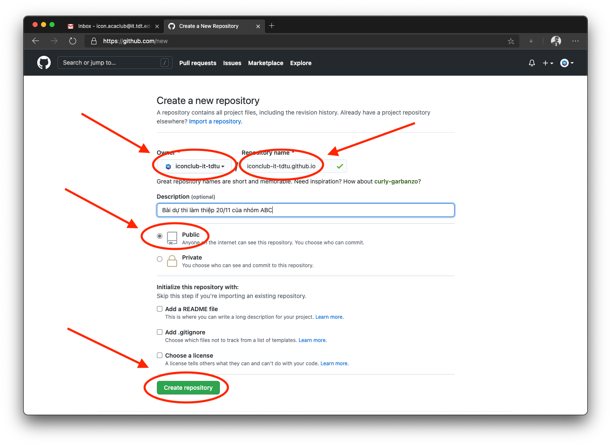
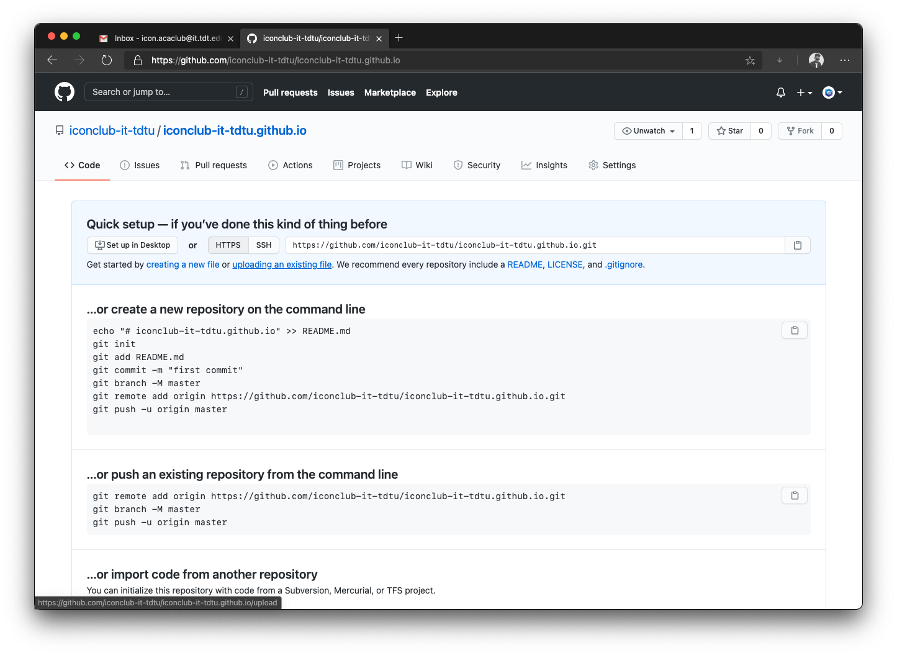
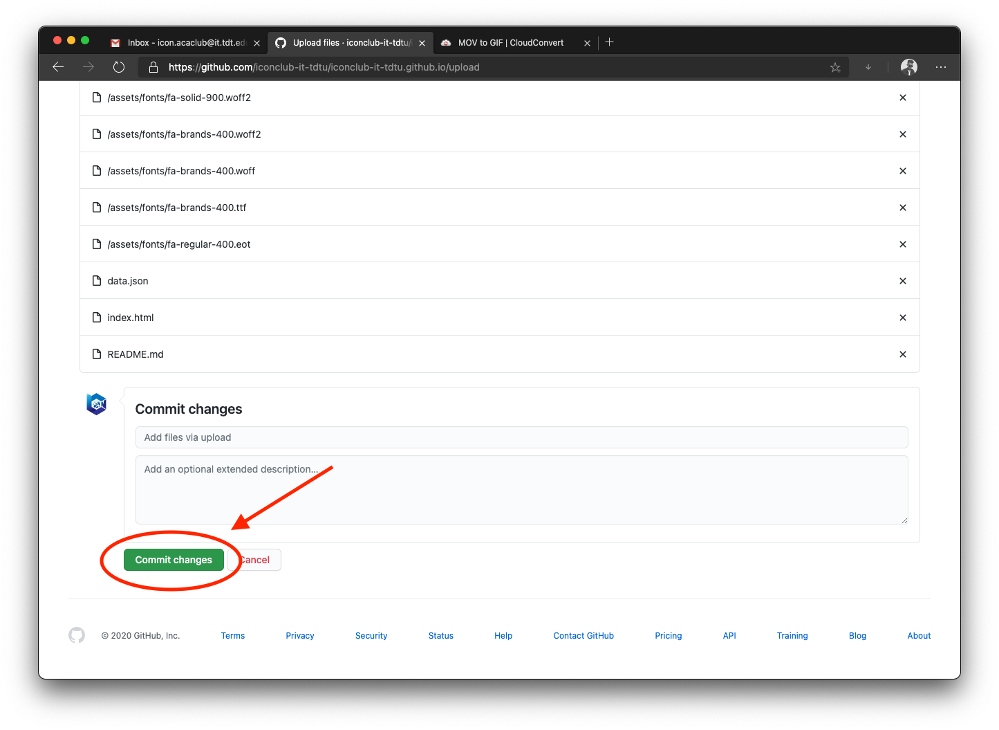
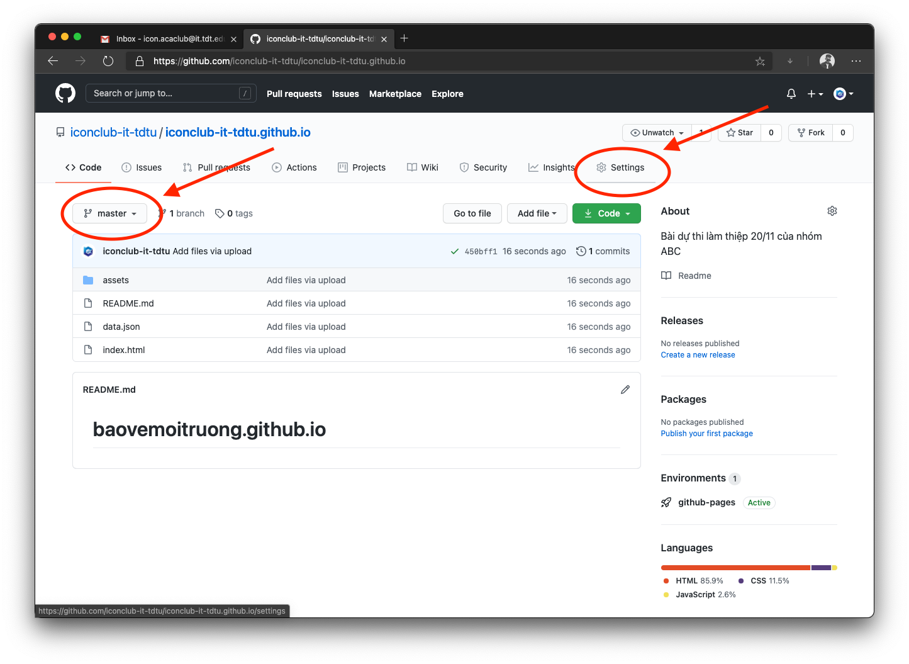
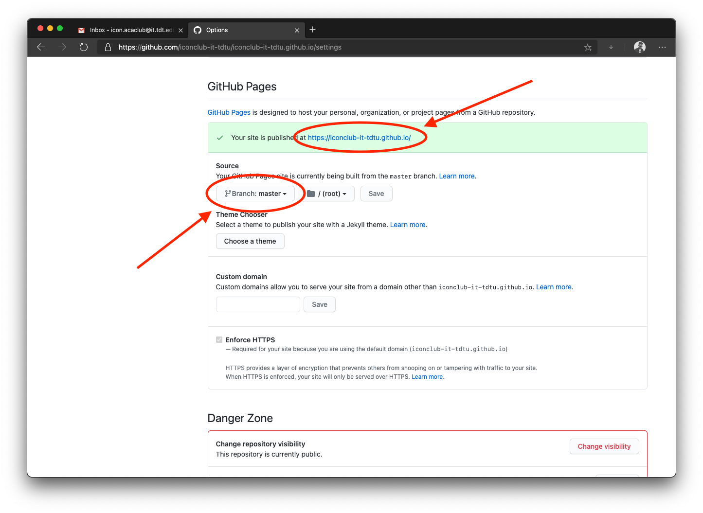

# HƯỚNG DẪN CÁCH TẠO GITHUB PAGE CHO CUỘC THI THIẾT KẾ THIỆP 20/11

## Bước 1. Tạo tài khoản Github

Trong bài hướng dẫn này, CLB sẽ sử dụng tài khoản Github của CLB. Tài khoản có tên là **ICON Club** và có username là **iconclub-it-tdtu**.

## Bước 2. Tạo một repository sử dụng Github Pages cho sản phẩm dự thi

Nhấn **New repository** ở trên góc phải trên cùng của trang web.

## Bước 3. Thiết lập repository

- Ở đây các bạn đặt tên cho repository theo đúng quy định của Github Page là **username.github.io** với username là tên username của bạn. _Vd: Nếu username là iconclub-it-tdtu thì tên repository là iconclub-it-tdtu-github.io_. (Bắt buộc)
- Các bạn phải đặt ở chế độ **Public**. (Bắt buộc)
- Cuối cùng các bạn nhấn **Create repository** để tạo.

### NHƯ VẬY LÀ CÁC BẠN ĐÃ TẠO XONG REPOSITORY TRÊN GITHUB PAGES. BÂY GIỜ HÃY THỬ UP MÃ NGUỒN SẢN PHẨM DỰ THI LÊN ĐỂ KIỂM TRA THỬ.

## Bước 4. Upload mã nguồn sản phẩm lên repository

- Sau khi tạo repository thành công, bạn sẽ thấy màn hình như trên. Nhưng lúc này repository hoàn toàn trống.
- Nhấn **uploading an existing file** để up mã nguồn của bạn.

- Kéo thả tất cả mã nguồn của bạn vào để upload. 

**Lưu ý là sản phẩm dự thi của bạn phải có file index.html, đồng thời cũng là file thiết kế thiệp chính. Vì Github Pages sẽ hiểu đây là trang chủ cho trang web sản phẩm dự thi của bạn**

- Sau khi file đã được upload, nhấn **Commit changes** để lưu.

## Bước 5. Ánh xạ lên Github Pages

- Sau khi upload mã nguồn thành công, bạn sẽ được kết quả như hình.
- Các bạn kiểm tra branch hiện tại để thiết lập ánh xạ sau đó. Như ở trên hình branch là **master**.
- Các bạn vô phần **setting** để tiến hành cài đặt.

- Các bạn tìm phần Github Pages, ở mục **Source** các bạn kiểm tra lại coi branch đã đúng chưa, nếu chưa thì chọn lại cho đúng branch.
- Nếu ánh xạ thành công thì sẽ có thông báo hiện là **Your site is published at ...**. Các bạn nhấn vào đường link đó để truy cập trang web của bạn.

### NHƯ VẬY LÀ CLB ĐÃ HƯỚNG DẪN CHO BẠN CÁCH TẠO GITHUB PAGES VÀ CÀI ĐẶT ÁNH XẠ SẢN PHẨM CỦA BẠN LÊN TRANG WEB.

Ở trên CLB chỉ hướng dẫn bạn cách đăng mã nguồn bằng các thao tác trên trang web. Ngoài ra các bạn có thể học thêm những cách khác bằng ứng dụng Github Desktop hay commandline để sử dụng Github cập nhật, quản lý mã nguồn tốt hơn. 

Tài liệu tham khảo
[Github Pages Guide](https://docs.github.com/en/free-pro-team@latest/github/working-with-github-pages)

Nếu có bất cứ khó khăn hay thắc mắc, hãy liên hệ cho CLB thông qua email hoặc fanpage
[icon.acaclub@it.tdt.edu.vn](icon.acaclub@it.tdt.edu.vn)
[https://www.facebook.com/iconclub.it.tdtu](https://www.facebook.com/iconclub.it.tdtu)
